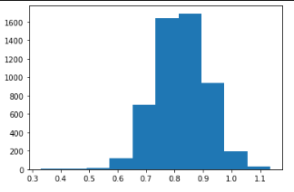

# Proyecto N°2 - Base de datos II

## Integrantes

- Arróspide, Eduardo
- Domínguez, Pedro

| Lista de actividades Realizadas                                      | Responsable                     | Participación |
| -------------------------------------------------------------------- | ------------------------------- | ------------- |
| Sequential, Query_Radius, R_tree, Kd_tree, Faiss HNSW                | Pedro Domínguez  | 100%          |
| Frontend, Experimentación                                            | Eduardo Arróspide| 100%          |

## [Video (Hacer clic aquí)]()

## Introducción

El objetivo del proyecto es el aprendizaje de estructuras multidimensionales que permitan búsquedas y recuperaciones eficientes de imágenes en un servicio web de reconocimiento facial.

Este proyecto utiliza algoritmos KNN de búsqueda **secuencial con cola de prioridad** y **rango con radio de búsqueda.** Asimismo, para búsquedas más eficientes aprovecha estructuras multidimensionales como el **Rtree**, **KDtree** y **Hierarchical Navigable Small World (HNSW)**

## Datos

Las imagenes utilizadas provienen de la universidad [UMASS](http://vis-www.cs.umass.edu/lfw/). Las  consultas son  cualquier  imagen  que  incluya  un  rostro y el resultado son el top-k de los personajes más parecidos.

## Construcción del índice

Para evitar codificar la colección de imágenes en cada consulta se contruyó un índice *.json* en donde se guarda la información de los rostros de cada imagen como un vector característico de 128 atributos. 


## Búsqueda secuencial

### Búsqueda KNN

El algoritmo de búsqueda secuencial se puede implementar de la siguiente manera:

1. Calcular las distancias euclidianas entre cada imagen de la colección y la consulta
2. Ordernar las distancias utilizando una cola de prioridad o un algoritmo de ordenamiento
3. Retornar las *top-k* imágenes

```python
def knn_sequential(faces_encoding, k, dataset):

    answer = []
    for path, matrix_vector_faces in dataset:
        for dis in face_recognition.face_distance(matrix_vector_faces, faces_encoding[0]):
            answer.append((path, dis))

    query_answer = sorted(answer, key = lambda x: x[1])

    return [path for path, distance in query_answer[:k]]
```

### Búsqueda por rango

De manera similar que el algoritmo de búsqueda secuencial, en la búsqueda por rango primero se deben calcular las distancias euclidianas entre la colección y la consulta. Sin embargo, el resultado de las *top-k* imágenes es filtrado por un rango de consulta.

```python
def radius_sequential(faces_encoding, r, dataset):
    answer = []
    
    for path, matrix_vector_faces in dataset:
        for dis in face_recognition.face_distance(matrix_vector_faces, faces_encoding[0]):
            if dis < r:
                answer.append((path, dis))

    query_answer = sorted(answer, key = lambda x: x[1])
    return [path for path, distance in query_answer]
```

El rango es un radio que se obtiene de estudiar la distribución de la colección de la siguiente manera:

```python
def calculate_radius(experiments, dataset):
    vector_dist = []
    for i in range(experiments):
        obj_1 = random.choice(dataset)[1]
        obj_2 = random.choice(dataset)[1]
        dist = face_recognition.face_distance(obj_1, obj_2[0])
        for dis in dist:
            vector_dist.append(dis)

    return (numpy.mean(vector_dist), numpy.std(vector_dist))
```

El número de experimentos realizados en este proyecto ha sido de 5000 y el resultado obtenido ha sido el siguiente:

<center>



</center>


Por lo tanto, un radio adecuado sería de 0.8 con margen de 0.1 para realizar consultas a **esta** colección

## R tree

El R tree es una estructura de datos en forma de árbol que agrupa objetos y los representa con un *mínimo bounding box* o MBB para cada nivel superior del árbol. Para este proyecto, a nivel de hoja cada MBB describe un conjunto de puntos en el espacion con 128 dimensiones en donde cada dimensión representa un atributo de la imagen de la coleccción.

```python
def knn_rtree(faces_encoding, k , dataset):
    name = 'knn/rtree_index'

    p = index.Property()
    p.dimension = 128 #D
    p.buffering_capacity = 4 #M
    p.dat_extension = 'data'
    p.idx_extension = 'index'
    idx = index.Index(name, properties=p)
    
    if idx.get_size() < 1:
        c = 0
        for path, matrix_vector_faces in dataset:
            for vector in matrix_vector_faces:
                q = tuple(vector)
                idx.insert(c, q)
            c+=1

    query = tuple(faces_encoding[0])
     
    lres = list(idx.nearest(coordinates=query, num_results=k))

    return [dataset[i][0] for i in lres[:k]]
```

Para este proyecto se utilizó la librería `rtree` de Python la cual permite crear la estructura con características específicas. Asimismo, para conseguir una mejor eficiencia en sus consultas de búsqueda KNN la construcción de su índice se realizó una sola vez.

Finalmente, la búsqueda KNN se realizó llamando a la función `nearest()` la cual recibe como parámetro una tupla que representa la consulta y un número entero *k* que indica cuántos elementos retornar.


## KD tree

```python
def knn_kdtree(faces_encoding, k , dataset):

    data = []

    dataset_index = 0
    faces_index = 0
    face_index_to_dataset_index = dict()

    for path, matrix_vector_faces in dataset:

        for face in matrix_vector_faces:
            face_index_to_dataset_index[faces_index] = dataset_index
            data.append(face)
            faces_index+=1

        dataset_index += 1
        
    tree = KDTree(data)
    distances, indexes = tree.query(faces_encoding, k)
    
    return [dataset[face_index_to_dataset_index[index]][0] for index in indexes[0]]
```

## Hierarchical Navigable Small World (HNSW)

```python
def knn_faiss(faces_encoding, k , dataset):

    index = faiss.IndexHNSWFlat(128, 32)

    data = []

    dataset_index = 0
    faces_index = 0
    face_index_to_dataset_index = dict()
    
    for path, matrix_vector_faces in dataset:

        for face in matrix_vector_faces:
            face_index_to_dataset_index[faces_index] = dataset_index
            data.append(face)
            faces_index+=1

        dataset_index += 1

    data = np.float32(np.array(data))

    index.add(data)

    xq = np.float32(np.array([faces_encoding[0]]))
    
    D, I = index.search(xq, k)
    
    return [dataset[face_index_to_dataset_index[idx]][0] for idx in I[0]]
```

## Frontend
El frontend de este proyecto se realizó con HTML5, CSS y JavaScript. Se trata de una interfaz sencilla y amigable, en la que se carga una foto con el fin de encontrar los personajes más parecidos en la base de datos. Utilizando el siguiente código de JavaScript, se muestra un preview de la imagen que el usuario subirá, para que pueda verificar que en efecto esa era la imagen que quería subir:
```javascript
const query_image = document.querySelector("#query_image");
var uploaded_image = "";

query_image.addEventListener("change", function(){
    const reader = new FileReader();
    reader.addEventListener("load", () => {
        uploaded_image = reader.result;
        document.querySelector("#preview_upload_image").style.backgroundImage = `url(${uploaded_image})`;
    })
    reader.readAsDataURL(this.files[0]);
})
```
Luego, utilizando forms de HTML5, se pasan los parámetros que serán utilizados para el cálculo de los K personajes más cercanos a la imagen del usuario. Una vez se submittea el form, se renderiza una página de resultados, en la que figurará la foto que el usuario subió, y los k personajes más cercanos, con nombre y foto. 

## Backend
El backend de este proyecto se realizó con Flask. 

**Moverse a la carpeta `/backend`**
### Setup
```terminal
pip3 install requeriments.txt
```

### Run
```terminal
python3 backend/main.py
```
